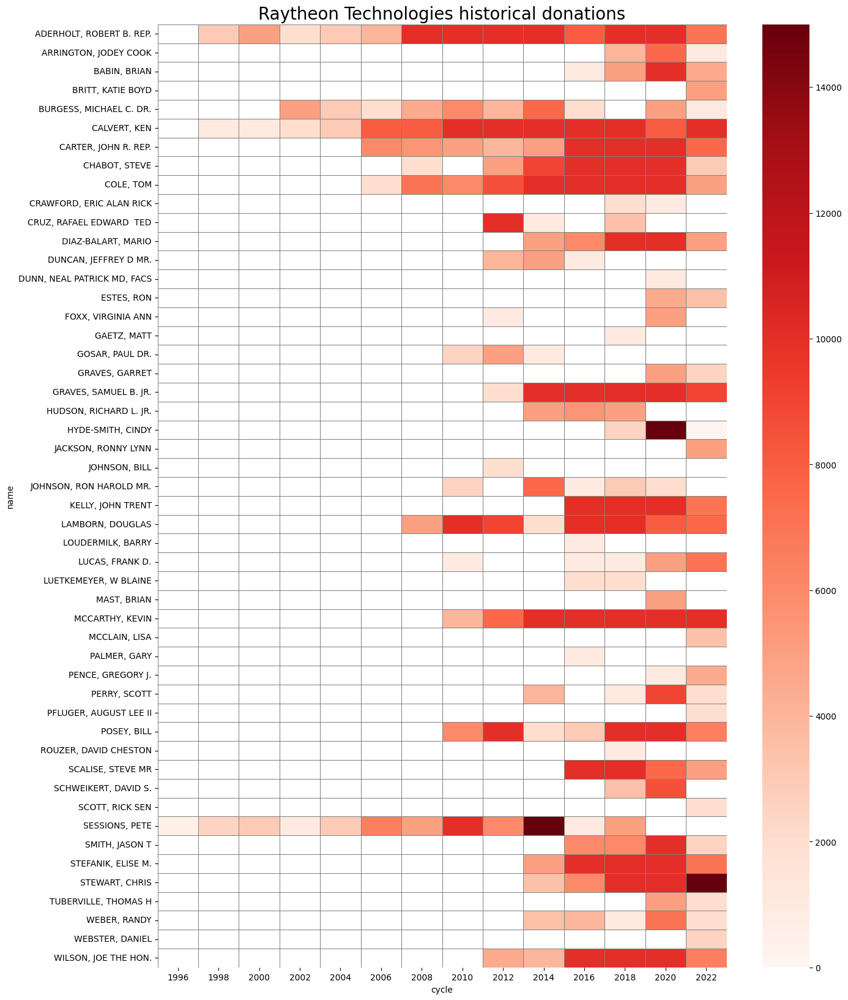

# pac_hunter :wolf:
A simple project inspired by frustration over employers attempting to raise money from their ~~employees~~ captive audiences for the purpose of fueling their purchase of loyalty from politicians via Political Action Committees (PACs) in the United States.

`pac_hunter` provides a wrapper around the fantastic API provided by the Federal Elections Committee called [OpenFEC](https://api.open.fec.gov/developers/). This tool is designed to match a PAC of interest with donations made to specific federal election candidates. The use case that inspired this tool was checking historical donations of a PAC to federal candidates or elected officials that denied the legitimacy of the 2020 election.

# Getting started
Check the jupyter notebook provided with this repository `demo.ipynb`. You will have to either request your own self-service API key from the OpenFEC project, or use their `"DEMO_KEY"` which has a stricter rate limit.

Run the demo notebook yourself in-browser with Binder [here](https://mybinder.org/v2/gh/jlwhelan28/pac-hunter/main?filepath=demo.ipynb)

##  Example: Raytheon Technologies' PAC donations to 2020 election deniers

# Future release
I'm hopeful to provide a small service that runs a `streamlit` app providing a simple interface to use this tool for non-developers. Beyond that, future plans will depend on interest.
